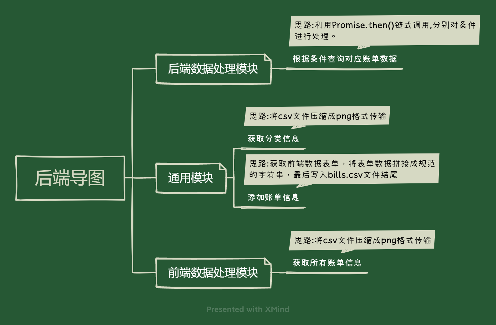
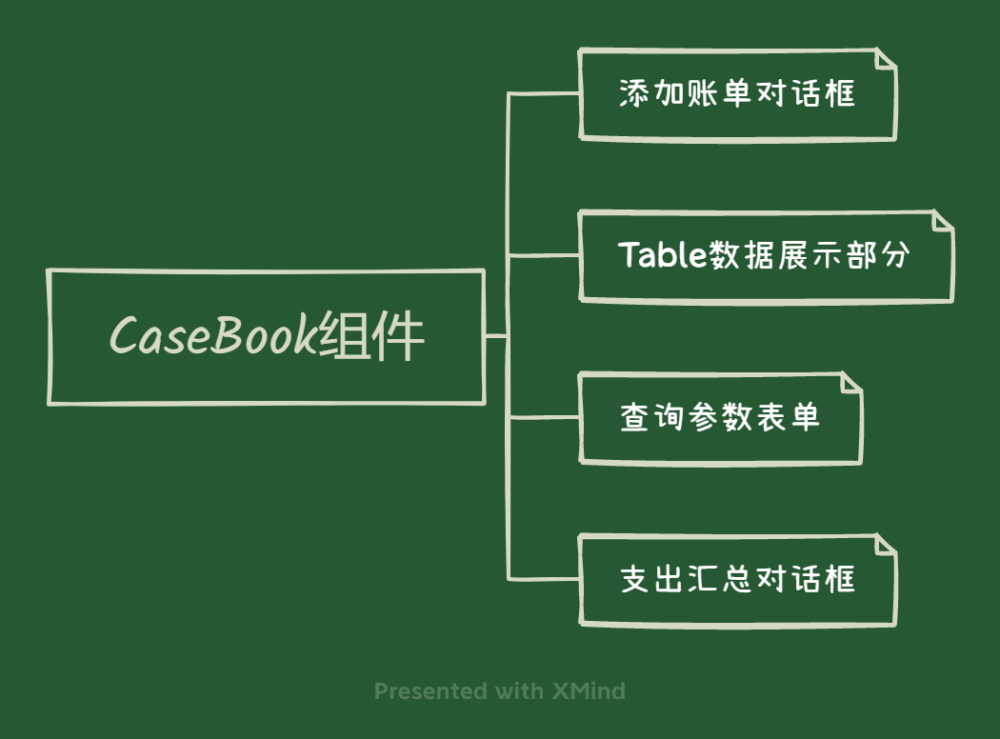
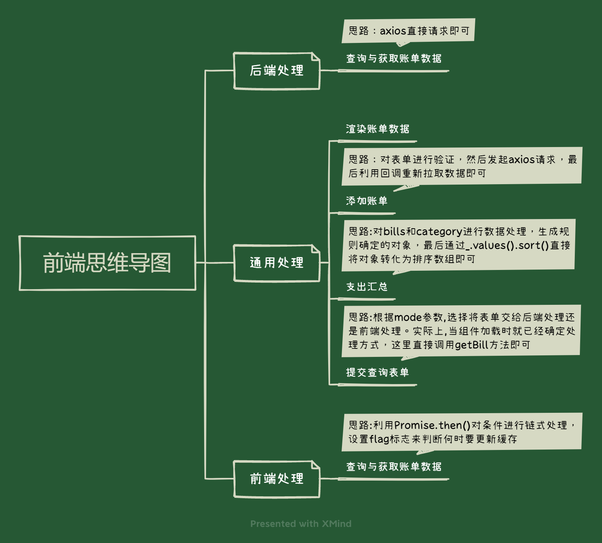
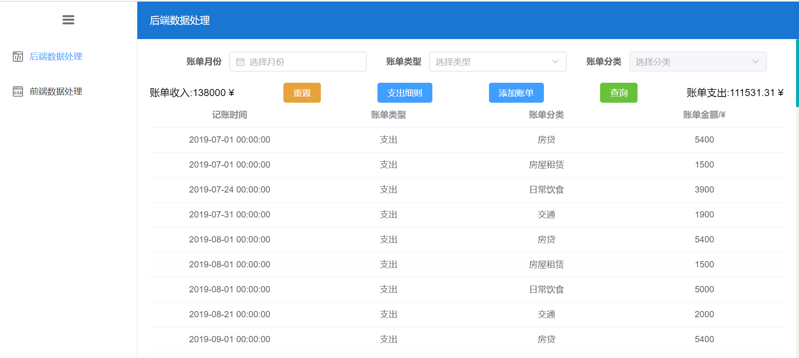
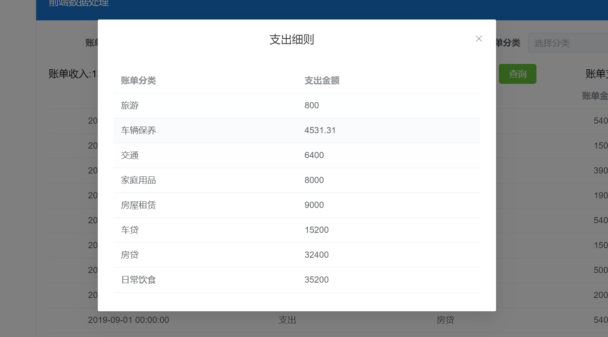
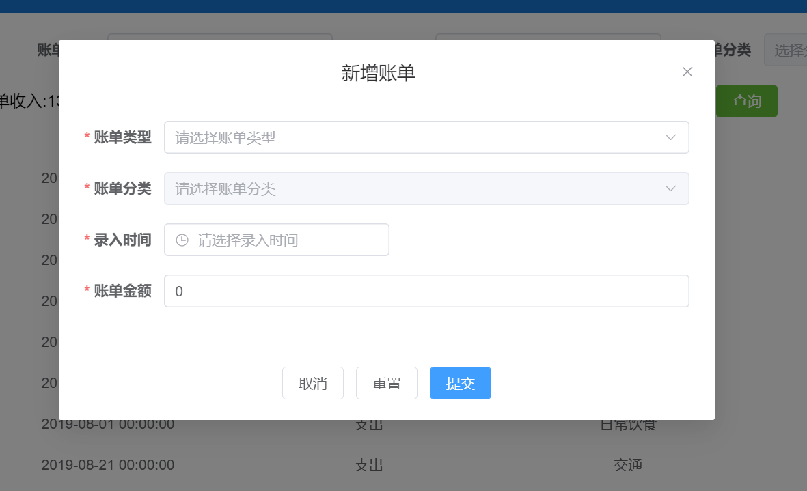

## Xmind简易记账本

XMind 前端面试大作业

### 技术栈

**前端：**Vue3框架，element-Plus组件库

**后端：**Node开发环境，Express框架

### 项目需求及完成度

**主要任务：**

- [x] 加载相关数据并以列表形式展示账单内容
- [x] 提供下拉框选择月份进行筛选
- [x] 支持使用者添加账单
- [x] 统计并展示所选月份的收入和支出总金额

**附加需求：**

- [x] 对账单分类进行二次筛选
- [x] 对选择月份内的所有账单根据账单分类进行支出金额统计，并进行排序

**个人优化**：

- [x] 对账单内容进行格式化

  ```txt
  time字段: 将时间戳转变为标准时间
     1561910400000   -------->   2019-07-01 00:00:00
  type字段：
  	0  --------> 支出  
  	1  --------> 收入
  category字段: 将分类ID转化为对应分类名称
      1bcddudhmh --------> 房贷
  ```

- [x] 支持账单类型（type字段），账单日期（time字段）,账单分类(category字段）的单独查询以及联合查询。

  其中账单类型（type字段）与账单分类(category字段）为二级联动下拉框。

- [x] 月份总收入金额为负数时，将自动转为月份总支出金额。反之亦然。

### 运行

前端----localhost:8888

```
npm install 
npm run serve
```

后端--- localhost:3000

```
npm install 
nodemon .\app.js 或 node .\app.js
```

### 基本思路

​		作业的基本考察点在于:利用CSV文件模拟数据库数据，后端获取模拟数据，通过HTTP请求返回给前端，前端对模拟数据进行渲染。

​		而模拟数据的数据处理可以分为两种：后端数据处理与前端数据处理。

​		**后端数据处理：**每次前端需要获取数据，都要利用HTTP请求，传递相关筛选参数或表单，向后端请求数据，后端根据参数对数据进行处理后，将前端所需数据通过响应返回给前端。

​		**前端数据处理**:在第一次请求时将获取所有请求数据，后续获取相关数据不在需要发送HTTP请求，只需对存储在内存中的所有请求数据进行相关处理，返回对应数据即可。但倘若数据过大，则第一次请求数据时间会过长，且服务端压力增大。

​       鉴于此次作业数据量并不大，因此后端数据处理和前端数据处理都可以。此次实现了两种处理方式。

#### 数据处理思路

​	  后端数据处理中，我将`bills.csv`文件视为数据库，`categories.csv`文件视为静态数据。

​	  因此，对于`bills.csv`文件的处理，是直接利用`fs`模块读取文件，再编写`CvstoJSON`函数将读取出来的字符串转化为`JSON`对象，在做后续的数据处理，响应返回的是一个`JSON`数据对象。

​	对于`categories.csv`文件的处理，可以直接请求服务器的csv数据,但这样有以下两个缺点：

1. 前端拿到的都是明文数据，可以在控制台中直接看到，数据保密性差。
2. 冗余数据比较多，数据体积相对比较大。

​      因此，本次将`categories.csv`文件压缩成`png`格式，将`png`数据以及其他相关信息发送给前端，前端在将`png`格式数据还原为`csv`文件，在将内容解析成`JSON`。

​	  前端数据处理中，则将`bills.csv`和`categories.csv`均视为静态数据，以上述方式进行处理。

后端的其他思路如下图所示：



#### 前端实现思路

前端主要通过进行`CaseBook`组件复用，实现后端数据处理和前端数据处理的视图展示。`CaseBook组件`由以下四个组件组成:



组件通过`mode`参数进行区分应该使用`后端处理模式`还是`前端处理模式`，实际上这两者本质还是一样的，除了处理方式不同以外，本质上还是更改同一个数据对象，利用数据的双向绑定渲染视图。前端的主体业务逻辑思路如下:



### 运行效果

主页



支出细则:



新增账单:



### 遇到问题以及解决方案

**浮点数计算精度丢失:**

​		因为要支持账单收入与支出的汇总，势必要累加计算账单数据，又因为需求中指出数据需要为浮点数保留两位小数。由于`JavaScript`执行机制----对于浮点数的计算将转换为二进制进行计算，因此会导致计算结果出现精度丢失的情况。

**解决思路：**

​		浮点数计算存在精度丢失的情况，但整数计算不存在这种情况，因此，可以将浮点数转化为整数进行计算，最后在将计算结果转化为浮点数。步骤如下：

- 以.为分隔符对数据进行分割，通过length得到小数点位数
- 选取小数点位数较大的位数，计算10的位数次方幂，得到乘方
- 数据分别乘方扩大，在进行相加（`小数转化为整数相加`）,最后除以乘方(`相加结果转换为小数`)

### 不足之处

​		本次开发较为匆忙，没有进行细致的组件划分，导致代码有一定程度上的耦合。实际上，可以在对`CaseBook`组件进行划分，利用`props`和`EventBus`进行父子组件通信（因为本次需求较为简单，因此没有打算使用vuex进行状态管理）。但是，虽然没有对组件进行划分，但是还是利用`Vue3`新特性-----组合式API,对项目的一些逻辑代码进行了拆分避免过渡耦合。

**严正声明：本次开发较为匆忙，不排除存在BUG的情况！！！！！（反正我自己测是没啥问题😀）**